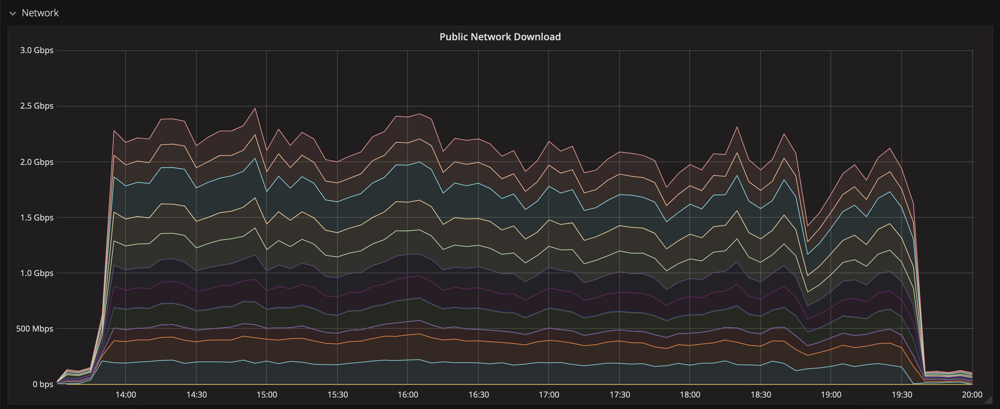
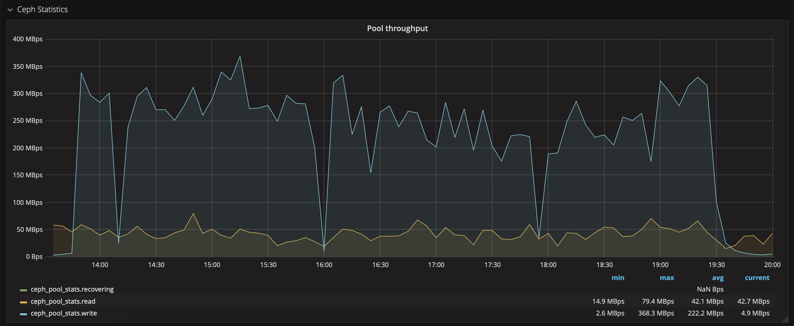

# Building the raw alert data lake

In case things go wrong, follow instructions. Requirements:

- openmpi
- aria2c
- pigz
- pandas, pyarrow, numpy, fink-client, fastavro, mpi4py...

and have a good internet connection! Steps were all done on a 16 cores machine with Centos 7, at the cloud at VirtualData (Université Paris-Saclay).

## List of observation nights

Go to [https://ztf.uw.edu/alerts/public](https://ztf.uw.edu/alerts/public), and copy the table in your clipboard (select lines, and copy). Then, just execute the `generate_uri.py` script

```bash
python generate_uri.py
```

This will generate a pandas DataFrame from the clipboard, estimate the volume of data to transfer, and save all needed URLs to download data (one per observation night). For convenience, nights will be split by groups of 5, stored in the folder `uris`.

## Download observation nights

Once you have the list of nights to transfer, it is time to transfer! We have a wrapper that do it for you:

```bash
./download.sh
```

Under the hood, this uses [aria2c](https://aria2.github.io/manual/en/html/index.html) to speed-up the download. I managed to get a rather stable transfer at 60 MB/s per file, for 5 files simultaneously (i.e. 300 MB/s). The transfer of 4.7 TB took about 5.5 hours:



and the writing on CEPH was quite stable as well:




## Format files for Apache Spark

The data transfered is made of compressed folders (`.tar.gz`) containing Apache Avro files. While this is good for an archive, this is not suitable for our processing. You need then to decompress the files, concatenate the data from individual Avro files into larger chunks, and save into Parquet files. 

The decompression is the slowest operation, and it is difficult to parallelize each task. We managed to slightly speed-up the process by using `pigz` and `tar` instead of `tar` alone (factor of 2 faster). The decompression rate was about 80 MB/s per file.

Once data is decompressed, we obtain one Avro file per alert, and there are hundreds of thousands alerts by folder! This deluge of small files is bad for the processing. Hence, the next operation is to concatenate many alerts at once. In addition, we perform a conversion from Avro to Parquet (the chosen format for internal operations in Fink). By concatenating 3000 raw Avro files into one single Parquet file (with snappy compression), we currently achieve a compression factor of about 1.6. Finally, files are saved into a partitioned structure (`year/month/day`) to speed-up subsequent operations. 


For doing all these steps, use the wrapper:

```bash
./concat.sh
```

The wrapper will look for all `ztf_public*.tar.gz` files, and do the job. To speed-up the merge operation, we use `mpi` under the hood. The script will use by default 16 cores -- leading to a writing throughput of about 170 MB/s.

As decompression and merge are done one after the other, and file by file, we shall obtain a rate of about 55 MB/s. In practice, we observe twice slower (why?). Note that it would have been perhaps wiser to parallelize the decompression step first (by parallelizing folders), and then parallelize the merging step (that way we would easily reach +300 MB/s for decompression, that is a total rate at +100 MB/s). Improvement for the future!

## Summary

| Step | Task | Throughput per task | Time for 4.7 TB |
|------|---------------|------|-----------------|
| Download | 5 nights | 300 MB/s | 5.5 hours |
| decompress+merge | 1 night | 33 MB/s | 42 hours |

So we could download and rebuild the whole alert data for 2020 and 2021 in about 2 full days. Note that with a wiser parallelisation of the decompression step, we could reach +100 MB/s, that is a total time divided by more than 2.